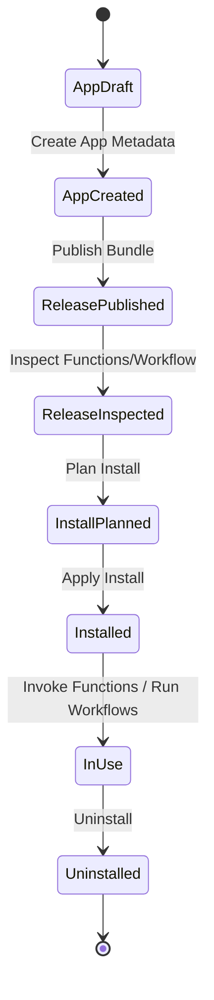

# App Store Interaction Flow (Nova / Lumen)

This document defines the end-to-end UX flow for app packaging and consumption.

## Scope

- Publisher side: create app, publish release, manage owned apps.
- Consumer side: browse store, inspect release details, install, use, uninstall.
- Resource model: release bundles may contain function sets and optional workflow DAG.

No backward-compatibility behavior is required.

## Roles

- Publisher: creates and publishes app packages (`/my-apps`).
- Consumer: installs and operates packages in tenant/namespace (`/store`, `/store/[slug]`).

## Core State Machine

## Publisher Flow (`/my-apps`)

1. Create app metadata
- Inputs: slug, title, summary, description, tags, visibility.
- Output: app record in store catalog.

2. Publish release bundle
- Inputs:
  - semantic version
  - changelog
  - publish source:
    - select existing functions/workflow from current scope (system auto-generates bundle), or
    - upload pre-built bundle (`.tar.gz`)
- Output: release entry with parsed manifest.

3. Verify package quality
- Open app detail and inspect:
  - Function metadata (runtime/handler/env/files/resources).
  - Workflow DAG structure.

4. Distribute to consumers
- Share app slug/detail page with tenant teams.

## Consumer Flow (`/store` -> `/store/[slug]`)

1. Discover app
- Browse app cards and open detail page.

2. Inspect release
- Check release status, function count, workflow presence.
- Use Release Inspector tabs:
  - Functions
  - Workflow
  - Manifest JSON

3. Plan install
- Choose version + install name + prefix + values JSON.
- Validate conflicts, quotas, and runtimes.

4. Install
- Trigger install job and poll job status.
- Persist installation records and managed resources.

5. Use resources
- Open installed function/workflow.
- Invoke function directly from installation resources.

6. Uninstall
- Remove installation and managed resources in current scope.

## API Contract Mapping

- App CRUD
  - `POST /store/apps`
  - `GET /store/apps/:slug`
  - `GET /store/apps`
  - `DELETE /store/apps/:slug`

- Release
  - `POST /store/apps/:slug/releases`
  - `GET /store/apps/:slug/releases`
  - `GET /store/apps/:slug/releases/:version`

- Install lifecycle
  - `POST /store/installations:plan`
  - `POST /store/installations`
  - `GET /store/installations`
  - `GET /store/installations/:id`
  - `DELETE /store/installations/:id`
  - `GET /store/jobs/:id`

## UX Rules

- Keep one clear next action visible at each stage.
- Show install status and errors inline; avoid blocking popups.
- Keep publisher management and consumer browsing separated:
  - Publisher management only in `/my-apps`.
  - Store browsing/install only in `/store` and `/store/[slug]`.
- Release inspection is mandatory before install in guided flow.

## Implemented UI Surfaces

- `/my-apps`: publisher workflow roadmap + create/publish management.
- `/store`: consumer workflow roadmap + catalog + installations.
- `/store/[slug]`: consumer workflow roadmap + release inspector + plan/install/use/uninstall.
